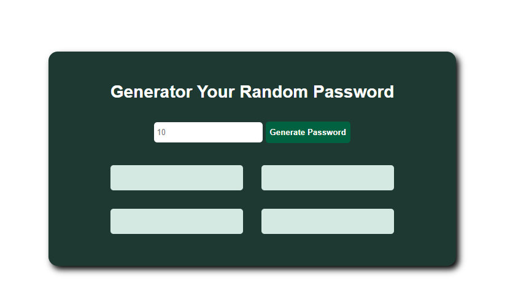

# Password Generator- Solo Project

A website that generates passwords

<h2>Overview</h2>
<h3>Screenshot</h3>
<h4>Desktop</h4>

<h2>Links</h2>
<ul>
  <li><a href="https://klypassword-generator.netlify.app/">Live</a></li>
</ul>

<h2>My Process</h2>
<h3>Languages</h3>
<ul>
  <li>HTML</li>
  <li>CSS</li>
  <li>JavaScript</li>
</ul>

<h3>What I learnt</h3>
<ul>
  <li>Error Handling</li>
  <li>CSS Grid Templates</li>
  <li>Event Listner</li>
  <li>JavaScript HTML styling</li>
</ul>

<h2>Acknowledgements</h2>
<ul>
  <li>Scrimba: <a href="https://scrimba.com">Scrimba</a></li>
</ul>

<h2>Author</h2>
<ul>
  <li>Github: <a href="https://github.com/klytne">@klytne</a></li>
  <li>Instagram: <a href="https://www.instagram.com/kly.tne/">@kly_tne</a></li>
  <li>LinkedIn: <a href="https://www.linkedin.com/in/kelly-tiengane-4b72572a6/">Kelly Tiengane</li>
</ul>